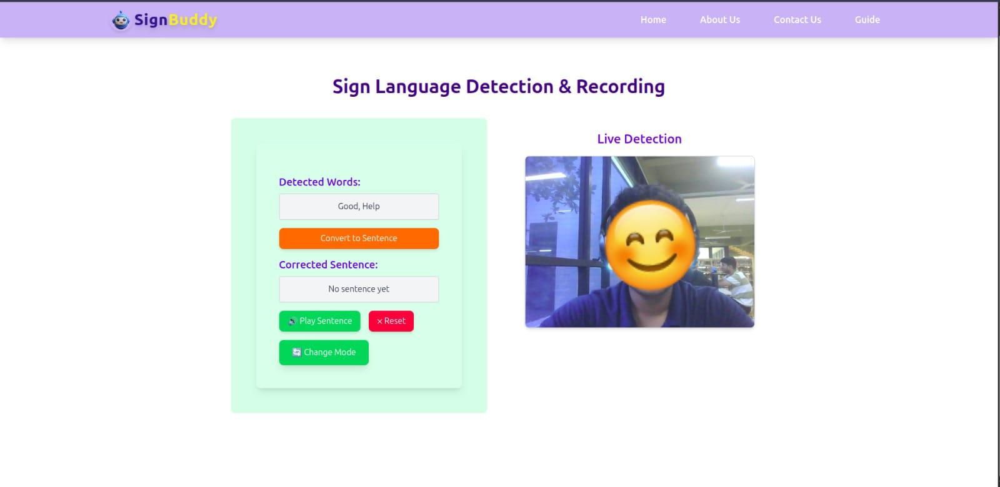

# SignBuddy




# Steps to start the project
(1) Clone the repo in your local system
```
git clone https://github.com/Pranav0786/SignBuddy.git

cd SignBuddy
```

(2) Set up the backend
```
cd Server
python3 -m venv venv
source venv/bin/activate
```

(3) Install all requirements and run 
```
pip install -r requirements.txt
python app.py
```

(4) Set up the frontend and run
```
cd Signbuddy
npm i
npm run dev
```
